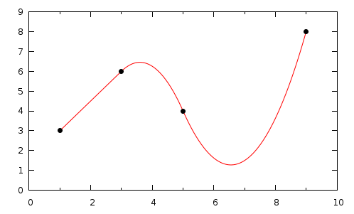
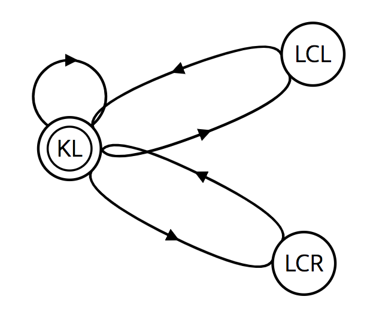
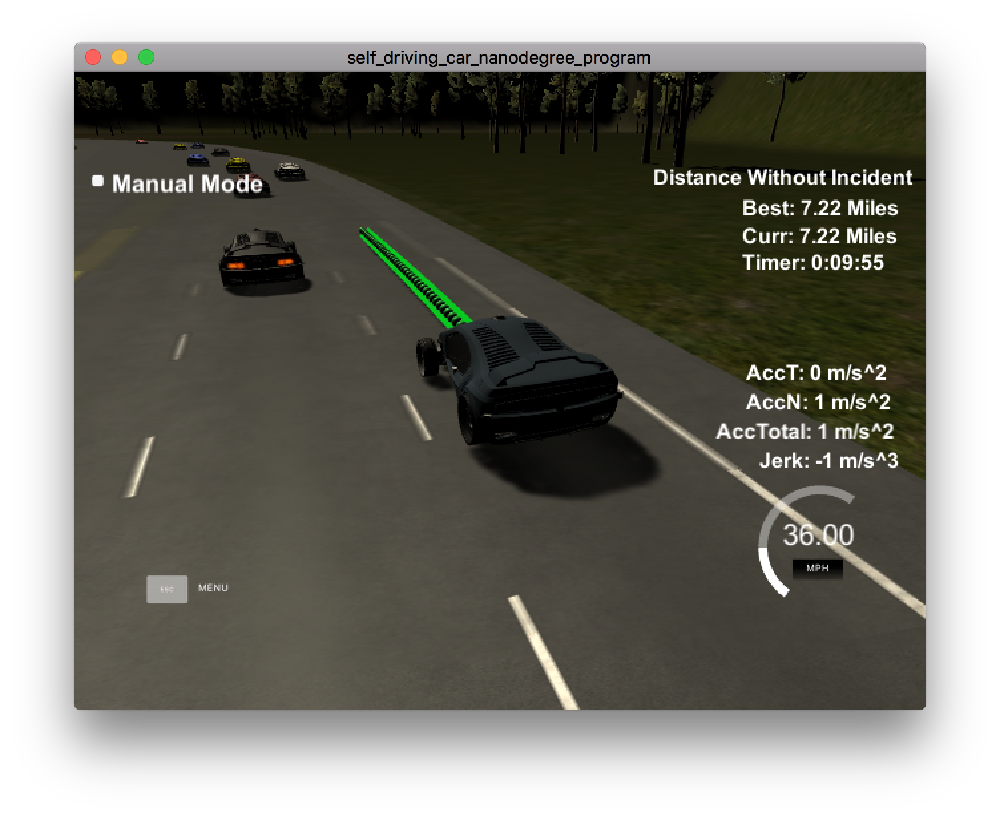
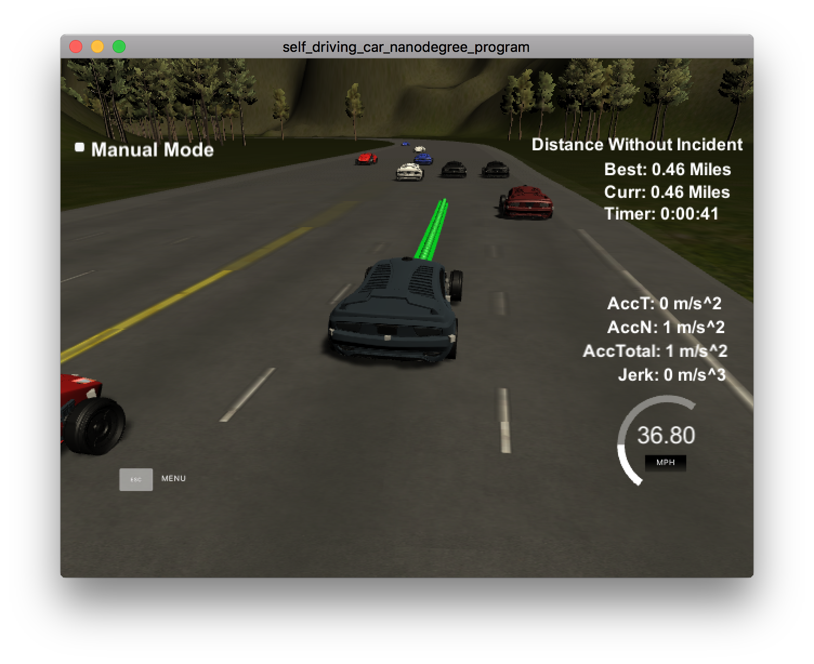

# Path Planning Project
Self-Driving Car Engineer Nanodegree Program
   
   
## Intro

The goal in this project is to build a path planner that is creates smooth, safe trajectories for the car to follow. The highway track has other vehicles, all going different speeds, but approximately obeying the 50 MPH speed limit.

The car transmits its location, along with its sensor fusion data, which estimates the location of all the vehicles on the same side of the road.

The project requieres a combination of different topics. We will need to use the data from sensor fusion to detect and predict the position of the other cars around us. With behaviour planning techniques we will create a state machine to decide which action we should perform. Together with the prediction and the state we will plan the best trajectory for the vehicle to follow.


### Goals
In this project your goal is to safely navigate around a virtual highway with other traffic that is driving +-10 MPH of the 50 MPH speed limit. You will be provided the car's localization and sensor fusion data, there is also a sparse map list of waypoints around the highway. The car should try to go as close as possible to the 50 MPH speed limit, which means passing slower traffic when possible, note that other cars will try to change lanes too. The car should avoid hitting other cars at all cost as well as driving inside of the marked road lanes at all times, unless going from one lane to another. The car should be able to make one complete loop around the 6946m highway. Since the car is trying to go 50 MPH, it should take a little over 5 minutes to complete 1 loop. Also the car should not experience total acceleration over 10 m/s^2 and jerk that is greater than 50 m/s^3.

#### The map of the highway is in data/highway_map.txt
Each waypoint in the list contains  [x,y,s,dx,dy] values. x and y are the waypoint's map coordinate position, the s value is the distance along the road to get to that waypoint in meters, the dx and dy values define the unit normal vector pointing outward of the highway loop.

The highway's waypoints loop around so the frenet s value, distance along the road, goes from 0 to 6945.554.


## Provided data


#### Main car's localization Data (No Noise)

["x"] The car's x position in map coordinates

["y"] The car's y position in map coordinates

["s"] The car's s position in frenet coordinates

["d"] The car's d position in frenet coordinates

["yaw"] The car's yaw angle in the map

["speed"] The car's speed in MPH

#### Previous path data given to the Planner

//Note: Return the previous list but with processed points removed, can be a nice tool to show how far along
the path has processed since last time. 

["previous_path_x"] The previous list of x points previously given to the simulator

["previous_path_y"] The previous list of y points previously given to the simulator

#### Previous path's end s and d values 

["end_path_s"] The previous list's last point's frenet s value

["end_path_d"] The previous list's last point's frenet d value

#### Sensor Fusion Data, a list of all other car's attributes on the same side of the road. (No Noise)

["sensor_fusion"] A 2d vector of cars and then that car's [car's unique ID, car's x position in map coordinates, car's y position in map coordinates, car's x velocity in m/s, car's y velocity in m/s, car's s position in frenet coordinates, car's d position in frenet coordinates. 

## Details

1. The car uses a perfect controller and will visit every (x,y) point it recieves in the list every .02 seconds. The units for the (x,y) points are in meters and the spacing of the points determines the speed of the car. The vector going from a point to the next point in the list dictates the angle of the car. Acceleration both in the tangential and normal directions is measured along with the jerk, the rate of change of total Acceleration. The (x,y) point paths that the planner recieves should not have a total acceleration that goes over 10 m/s^2, also the jerk should not go over 50 m/s^3. (NOTE: As this is BETA, these requirements might change. Also currently jerk is over a .02 second interval, it would probably be better to average total acceleration over 1 second and measure jerk from that.

2. There will be some latency between the simulator running and the path planner returning a path, with optimized code usually its not very long maybe just 1-3 time steps. During this delay the simulator will continue using points that it was last given, because of this its a good idea to store the last points you have used so you can have a smooth transition. previous_path_x, and previous_path_y can be helpful for this transition since they show the last points given to the simulator controller with the processed points already removed. You would either return a path that extends this previous path or make sure to create a new path that has a smooth transition with this last path.

## Implementation

### Trajectory generation

To start with the implementation I followed the project walktrhough and Q&A session. So I progressively implement a path planner, starting from driving in a straight line until the end of the video, where a very basic lane changing was implemented.

From this implementation I have reused the path planning solution. To start calculating the path we take as a starting point the end of the previous path or the current location of the car, if there is no previous path. We take the last two points and include three more. These three new points there will be the position of the car in a certain distance. In my case: 50, 100 and 150 meters. For simplicity, I calculated the values in Frenet coordinates and then use the function `getXY` to translate to cartesian coordinates. Once I have this vector with 5 points I use [spline](http://kluge.in-chemnitz.de/opensource/spline/) for the points interpolation. This will create a smooth polynomial to calculate the path. 



Once I have the spline I will calculate the new point for the path. I will reuse the points from the previous path, to ensure an easy transition and reduce computing time, and fill up with new points up to 50, which is the maximun I set. To create new points, we calculate the `x` position taking into account the velocity we are driving, and the `y` position from the spline function. 

### Behavior planning

For behvior planning I used a FSM with three states. My states are:

* Keep Lane (KL)
* Lane Change Left (LCL)
* Lane Change Right (LCR)



At the beginning I started with two more states: Prepare lane change left (PLCL) and Prepare lane change right (PLCR). But after I while I realised that for this project I could work with a simple version of just three states. 

To decide which state should I transition I use all the info about my current state, the maps and the cars around me, and the FSM will suggest a state that is feasible, safe, legal and efficient.

Something that is not responsable the FSM is to avoid colission. Basically for every iteration we will check if there is at least 50 meters between the ego car and the car situated in the same lane in front of us. Depending on the distance the car will speed up without passing the legal limit, or slow down to keep the same speed from the car in front of us. This code can be found in the `main.cpp` between the line 227 and 261.

Once we have all the information, we we calculate the possible states and the cost associated to each state. To calculate the cost we use the following functions:

* `getDistanceCarCost`: cost depending of the distance from the ego car to the car in front.
* `stayOnTheRoadCost`:  to ensure that the car does not drive off road or in wrong direction.
* `changeLaneCost`: cost of changing lanes. This cost is mostly for efficiency. 
* `getSpeedCost`: cost depending on the velocity of the ego car. This will be very important to decide changing lanes.
* `avoidCollisionCost`: cost to avoid collisions when changing lanes.

All the cost functions can be found in `costFunctions.cpp` file. The possibilities of cost functions are huge. But with this set I have been able to drive savely, being efficient and driving to the maximum speed allowed most of the times. 

One last point is to include weight for the cost functions. All the cost functions return a value between 0 and 1. But not all the functions have the same importance. Some functions are very important, because avoid doing something ilegal or fatal, but some others are just for comfort or efficiency. That's why I include some weights in the method `calculateCostForState` in the `main.cpp`, when calculating the cost of each state.

#### Notes

* Despite the car is driving most of the time a maximum velocity. Many times, there are cases when the car is "stuck", because traffic conditions. This in some cases could have been improved with more efficient function costs. Here are some cases:




* Create the cost functions and set the right weight took me a lot of time of try and error. I would have liked created a more complete set, to not just make the car drive through the track, but respect the rules as, just overpass cars on the left.

	
---

## Dependencies

* cmake >= 3.5
 * All OSes: [click here for installation instructions](https://cmake.org/install/)
* make >= 4.1
  * Linux: make is installed by default on most Linux distros
  * Mac: [install Xcode command line tools to get make](https://developer.apple.com/xcode/features/)
  * Windows: [Click here for installation instructions](http://gnuwin32.sourceforge.net/packages/make.htm)
* gcc/g++ >= 5.4
  * Linux: gcc / g++ is installed by default on most Linux distros
  * Mac: same deal as make - [install Xcode command line tools]((https://developer.apple.com/xcode/features/)
  * Windows: recommend using [MinGW](http://www.mingw.org/)
* [uWebSockets](https://github.com/uWebSockets/uWebSockets)
  * Run either `install-mac.sh` or `install-ubuntu.sh`.
  * If you install from source, checkout to commit `e94b6e1`, i.e.
    ```
    git clone https://github.com/uWebSockets/uWebSockets 
    cd uWebSockets
    git checkout e94b6e1
    ```

